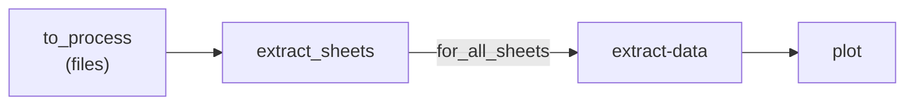
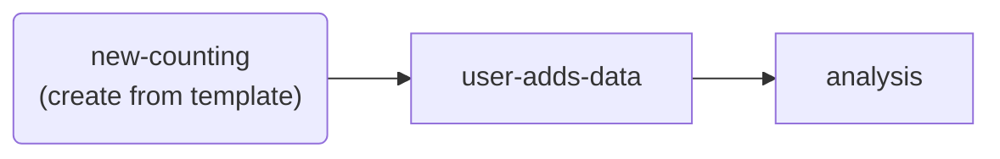
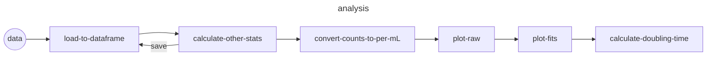

# cell-counts

Cell counting database and auto-plotting repository.

## Control Idioms

+ All data files must be added to the `datafile` directory.
+ `filelogs.yml` must not be modified by a human user. It is only inteneded to be used by GitHub Actions.
+ Excel sheet name with an asterisk (*****) will be ignored.

## Control Flow

## Usual Cell Counting and Plotting

