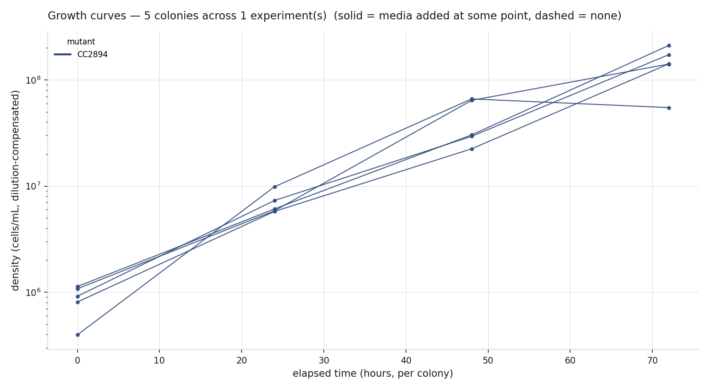
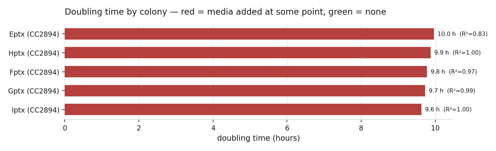

# cell-counts

Cell density measurements for the Trappy-Scopes lab, and the growth-curve
analysis built on top of them.

**Published as a site:** https://trappy-scopes.github.io/cell-counts —
an interactive growth-curve explorer (Bokeh: pan, zoom, hover, click a
legend entry to hide a colony), plus the same dilution-compensated growth
rate, doubling time and fold-change analysis as a set of static figures for
anyone just browsing the repo.

## Recording an experiment

The counting and analysis logic lives in each experiment's own
`scripts/cellcounting.py` (a copy of the current version is placed there by
`create_exp`, which wraps the Trappy-Scopes framework's
`Experiment.Construct`). The core calls:

```python
create_exp(...)                                    # opens the experiment
new_count("Gptx", 12, 14, 13, 15, df=2, mutant="CC2894")
log_media_addition("Gptx", volume_before_ml=4, media_added_ml=16)
fit_curve()                                         # growth curves + summary
analyse_growth()                                     # cross-colony comparison
export_csv()
```

`new_count` and `log_media_addition` both take `date_override` /
`time_override`, for entering counts after the fact when you're sure of the
date but not the exact time.

## Adding an experiment to the archive

1. Run the workflow above as usual through to `fit_curve()` /
   `analyse_growth()` — this populates that experiment's `analysis/` folder.
2. Leave (or copy) the experiment folder under `data/<experiment-name>/`.
3. Commit and push.

Everything below regenerates itself — the site, the two overview figures,
the interactive explorer. Nothing to run locally unless you want the
tracked `plots/*.png` snapshots (shown below) refreshed too; see
[`docs/data.md`](docs/data.md).

## Figures

### Growth curves



All colonies to date, dilution-compensated so that media additions read as
continuations of the same exponential rather than sudden drops.

### Doubling time



### Interactive

`plots/interactive.html` — Bokeh, pan/zoom/hover, one tab per experiment,
click a legend entry to hide or show a colony.

**GitHub cannot display it.** README HTML is sanitised, and files viewed in
the repo are shown as source. It's published on the site above, and also
uploaded as a workflow artifact (`parsed-data`, plus the run's own
artifacts) on every push under the **Actions** tab.

See [`docs/methodology.md`](docs/methodology.md) for what "dilution
compensation" and "growth rate" mean precisely, and how a continuously
diluted colony (media added more than once) gets a segment-wise rate
instead of one blended fit.

## Legacy

Before this repo used the Trappy-Scopes experiment framework, counts were
tracked in per-file CSV templates and analysed by a fixed set of scripts.
That pipeline — and the counts it recorded — is kept in `legacy/` for
reference, and the repository exactly as it stood before this
reorganisation is preserved as the `legacy` branch. See
[`legacy/README.md`](legacy/README.md).

---

*Restructured, instrumented, and this site built by Claude, reviewed by
Yatharth Bhasin.*
